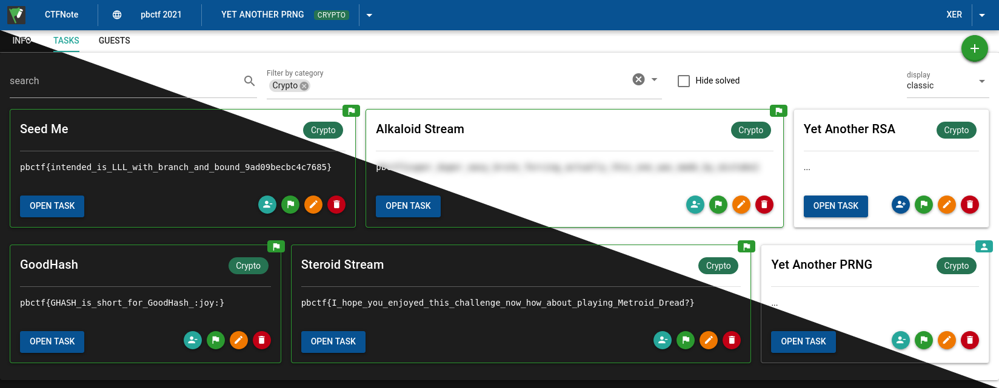

# CTFNote

## Welcome

CTFNote is a collaborative tool aiming to help CTF teams to organise their work.




## Installation

Use the provided docker configuration to deploy the project:

```shell
$ docker-compose up -d
```

Then, visit 127.0.0.1 and create your first account, which will automatically be provided with admin privileges

You can optionally edit the API configuration file depending on your needs:

[API Configuration File](./api/src/config/globals.ts)

## Privileges

We use a cascade privilege system. That means ADMIN users have all the rights MANAGER users have and MANAGER have all the rights MEMBER users have and so on.

* ADMIN: Can create and manage CTFs, as well as managing the instance ( managing users and configuration of the platform ).
* MANAGER: Can edit CTFs information and invite guests into a specific CTFs.
* MEMBER: A member represents a standard CTF player from your team, he can access all the CTFs of the platform by default
* GUEST: no privileges: can only view CTFs when invited; this is used for irregular guests ( ponctually invited user ). GUESTs are allowed to create and edit tasks, but not the CTF information.

## Security

cf. [SECURITY.md](./SECURITY.md)

## Development

The development server includes a simple HTTP proxy allowing the frontend to access the local API (cf [quasar.conf.js](front/quasar.conf.js)).
Hot reloading is configured on both components as well.

### Setup and launch the frontend

```shell
$ cd front/
$ yarn install
$ yarn start
```

### Setup and launch the API

```shell
$ cd api/
$ yarn install
$ yarn start
$ MD_PROVIDER=https://ur-codimd-instance-full-url yarn start
```

## Authors

[BitK](https://twitter.com/bitk_)
[SakiiR](https://twitter.com/sakiirsecurity/)

